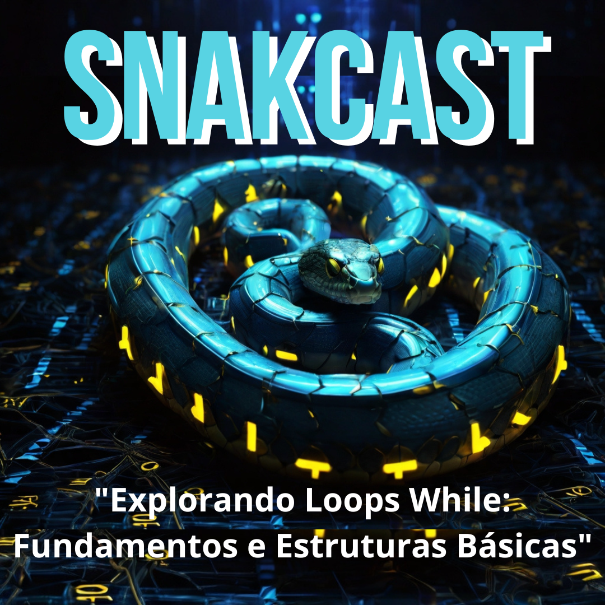

# Projeto Podcast Gerado por I.A.s da DIO

Projeto com o objetivo de gerar um podcast utilizando ferramentas de IA através de prompts mais trabalhado.

Utilizer uma esteira de prompts para gerar cada etapa do processo criativo.

## 💻 Tecnologias utilizadas no projeto

- [ChatGPT](https://chat.openai.com/) 
- [Leonardo AI](https://app.leonardo.ai/)
- [ElevenLabs](https://beta.elevenlabs.io/)
- [Capcut](https://www.capcut.com/pt-br/)
- [Canva](https://www.canva.com/)

## ✨ Como foi feito ?

- Roteiro gerado via chatgpt
- Audio gerado pela elevenLabs
- Leonardo AI Para gerar capas
- Capcut para tratar aúdio e adicionar sons de fundo
- Canva para editar capa

## 🛠️ Instruções de execução

Utilize os prompts dentro do link do `Notion` fornecido na parte de `Materiais` para criar um podcast de maneira automatizada, para isso siga o passo a passo abaixo.

- 🤖 1. Use os prompts de roteiro no `chagpt`
- 🤖 2. Use os prompts de roteiro gerados pelo chatgpt no  `ElevenLabs`
- 🤖 3. Use os prompts de artes no `Leonardo Ai`
- 🤖 3. Edite as artes no `Canva`

## Prompts

- Chat GPT - atue como roteirista de podcast e faça um roteiro de um podcast sobre while em python com introdução dois parágrafos grandes e conclusão, a introdução como a de um vídeo youtube para nerds
- Leonardo Ai - oroborus symbol like snake in blue and yellow colors, with blue electrical sparks and a background made of black with green computer codes
